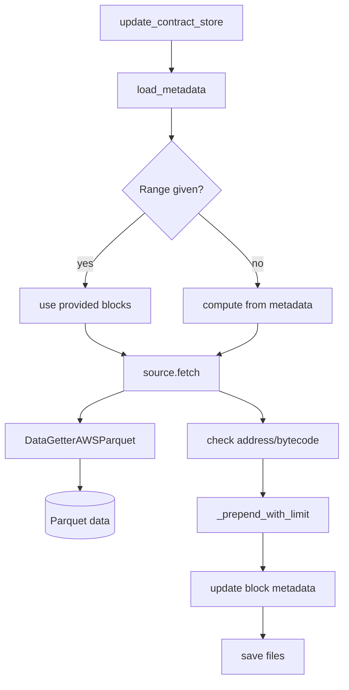

# Data Download Flow

This document explains how contract bytecode is downloaded and stored in the
repository. The main entry point is `tool/contract_downloader.py` which uses
a `DataSource` implementation to fetch contract data and manages the local
contract store.

## Overview

1. **Load metadata** – previous download state (oldest block, newest block and
   size limit) is read from `contracts/metadata.json` or created if it does not
   exist.
2. **Determine block range** – the block range to fetch is calculated based on
   the metadata and optional `start_block`/`end_block` arguments. If no range is
   provided, the current block number of the source is used.
3. **Fetch contracts** – the chosen `DataSource` retrieves contract dictionaries
   using its `fetch` method. The provided `ParquetSource` relies on
   `DataGetterAWSParquet` to read data from a Parquet dataset (local or S3).
4. **Validate data** – each returned contract must contain an address, bytecode
   and the block number. Invalid entries raise an assertion error.
5. **Write to file** – new contracts are prepended to
   `contracts/contracts.jsonl` using `_prepend_with_limit`, which enforces the
   configured size limit and verifies that all JSON lines remain intact.
6. **Update metadata** – after writing, the block range stored in
   `contracts/metadata.json` is updated to reflect the newest and oldest blocks
   currently saved.

## Diagram

